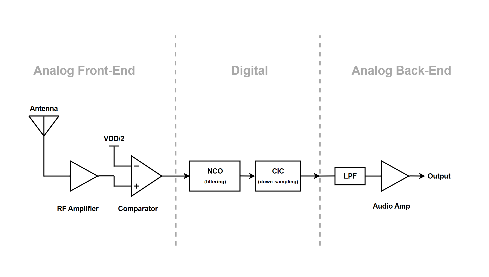

# Project Proposal - Angela & Ethan

### 1. Statement of Purpose

**Digital Radio:** The purpose of this project is to implement a digital radio that converts radio frequency (RF) signals into digital data. This data can then be processed, transformed, and retransmitted through a speaker.

Through the use of a numerically controlled oscillator (NCO), a digital mixer, and a decimation filter, we can efficiently downsample high-frequency signals to audio frequencies.

### 2. System Diagram

### 3. I/O Pin Assignments

| **I/O Pin**  | **Usage** |
| --- | --- |
| ui_in [0] | Dedicated input: digital 1-bit RF input  |
| ui_in[7:1] | Dedicated input: Frequency control  |
| ui_out [0] | Dedicated output: decimated baseband audio output |
| clk | Clock |
| rst_n | Active-low system reset |

### 4. Proposed specification

| **Specification** | **Value** | **Notes** |
| --- | --- | --- |
| Tuning Bandwidth | 535kHz - 1800kHz | Frequency range for AM radio broadcasts |
| NCO Bit Width | 16 bits | Determines how finely we can tune to specific frequencies. 16 bits should give us good precision without taking up too much space. |
| Decimation Factor | 1024 | Lowers sample rate from 50MHz to ~48kHz, which is standard for audio. |
| Audio Resolution | ~10-bit  | Below CD quality, but good enough and saves on space. |

**Tiny Tapeout Restrictions:**

| **Specification** | **Value** | **Notes** |
| --- | --- | --- |
| Clock Speed | 50MHz | Limits the frequencies we can measure (can’t receive FM radio signals) |
| Demo-board Voltage | 3.3V | Determines what we read as a HIGH (1) or LOW (0) |

### 5. Timeline of completion / Who Does What?

| **Date** | **Description of Task** |
| --- | --- |
| Week 3 (Sept 24 - Oct 1) | Project Proposal [ Both ] • Preliminary research • Create block diagram • Define I/O assignments • Define proposed project specifications |
| Week 4 (Oct 1 - Oct 8) | Verilog code [ Both ] • Create project Verilog file structure • Assign and initiate I/O wires and paths according to I/O table • Download LTSpice |
| Week 5 (Oct 8 - Oct 15) (Reading Week) | Verilog code • NCO implementation with digital mixer [ Angela ] • CIC implementation [ Ethan ] |
| Week 6 (Oct 15 - Oct 22) | Verilog code [ Angela ] • PWM Audio Output implementation • Create CocoTB tests for previously implemented components  Analog design [ Ethan ] • Initial circuit designs in LTSpice |
| Week 7 (Oct 22 - Oct 29) | (**Midterm Week**) |
| Week 8 (Oct 29 - Nov 5) | Analog design • Use LTSpice simulation for testing / verification [ Angela ] • Tune component specs based on testing [ Ethan ] |
| Week 9 (Nov 5 - Nov 12) | Review / Testing [ Both ] • Run synthesis with TinyTapeout • Debug and review synthesis errors • Work on any areas that require attention |
| Week 10 (Nov 12 - Nov 19) | Review / Testing [ Both ] • Run synthesis with TinyTapeout • Debug and review synthesis errors • Work on any areas that require attention |
| Week 11 (Nov 19 - Nov 26) | Review / Documentation [ Both ] • Update all documentation on GitHub (`/docs` folder) • Final preparations for Final Submission |

---

### References

- [https://www.i2phd.org/code/ARM_Radio.pdf](https://www.i2phd.org/code/ARM_Radio.pdf)
- [https://tinytapeout.com/specs/clock/](https://tinytapeout.com/specs/clock/)

Proposal examples:

- https://github.com/Krisphy/tt-ece298a-demoscene/blob/main/docs/ECE298a%20Proposal%20-%20Sunnie%20%26%20Krish.pdf
- https://github.com/jamesrosssharp/tt09-am-sdr/blob/main/docs/info.md
- [https://github.com/Rongbin99/ece298a-f25/blob/main/docs/schedule.md](https://github.com/Rongbin99/ece298a-f25/blob/main/docs/schedule.md)